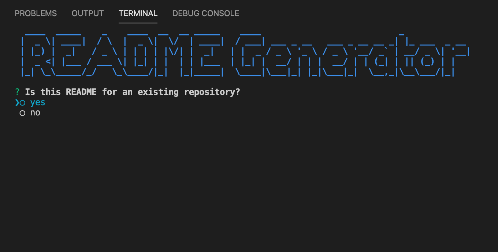

# readme_generator

## Description
This CLI App will ask the user questions and utilize a pre-made template to create a README unique to the user.

## Table of Contents
* [Title](#Title)
* [Description](#Description)
* [Installation](#Installation)
* [Usage](#Usage)

## Installation
In order to get started with the application, node.js must be installed and the user will have to run an 'npm install' as well as 'npm install inquirer' in order for the prompts to run. The entirety of this application occurs in the terminal.

## Usage
Open up the terminal, run 'npm install', run 'npm install inquirer', run 'npm install axios', and on the command line once all those tools are installed, type 'node index.js'. If more modules are needed, install as prompted. 

## Questions

